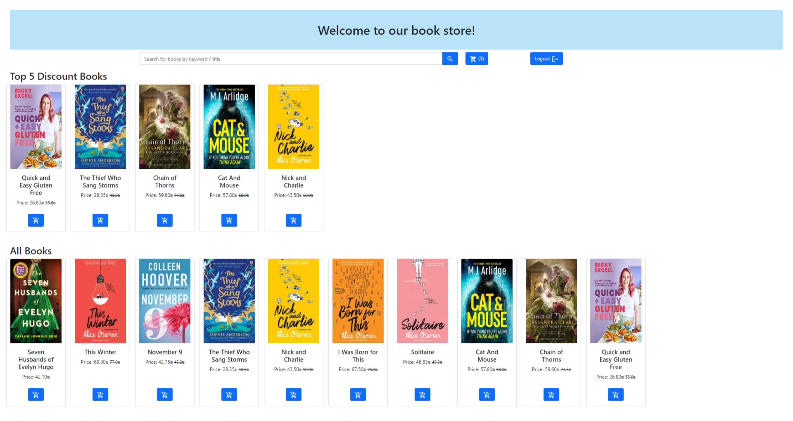
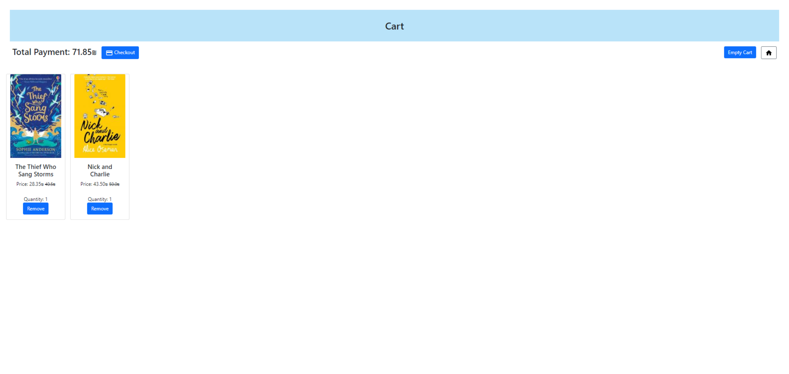
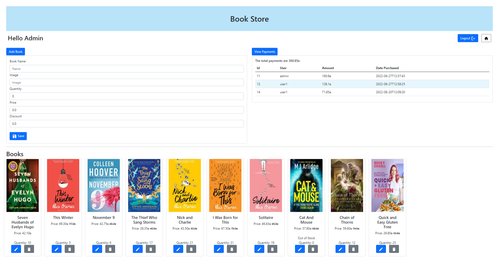

# Online Book Store

## Authors

* [Shaked Vaknin](https://github.com/shakedva)
* [Noy Tal Gelfand](https://github.com/noytal1)

## General Information

An online book store created with Spring-Boot and Thymeleaf.  
The shopping cart is implemented with session Beans.  

There are 2 zones in this website
<ol>
<li>Admin Zone</li>
    <ul>
    <li>Admin zone is protected with Spring Security.</li>
    <li>Add new books to the store.</li>
    <li>Edit or delete the books in the store.</li>
    <li>View all processed payments.</li>
    <li>Admin can also access the store.</li>
    </ul>

<li>Store Zone</li>
    <ul>
    <li>View the top 5 books with the biggest discount.</li>
    <li>View all the books in the store.</li>
    <li>Search books with a relevant keyword.</li>
    <li>Add to shopping cart.</li>
    <li>View and edit shopping cart.</li>
    <li>Purchase items from shopping cart - access only to logged-in users. </li>
    </ul>
</ol>

## Assumptions

* The admin cannot add/edit a book with a discount of 100% or more.
* By the time the user completes the payment, the stock might change. If a book is not available anymore
the payment will be canceled and will show a relevant message. 
The user will need to remove items that are out of stock. Books that are no longer in the store (deleted) will be removed
automatically from the user's cart.
* The database is named `ex4.sql`.

## Screenshots

